## Why do we need quasi-experiments?

Many important questions can't be answered with randomized experiments:

. . .

- Does the minimum wage reduce employment?
- Does going to prison increase or decrease future crime?
- Does expanding health insurance improve health outcomes?

. . .

> **The problem:** We can't randomly assign wages, prison sentences, or health coverage.

---

## Natural experiments

Sometimes the world gives us variation that *looks like* an experiment.

. . .

**Natural experiment:** Real-world variation that allows researchers to identify causal effects without explicit randomization.

. . .

The key insight: Find settings where treatment is determined by factors *unrelated* to outcomes.

---

## The quasi-experimental toolkit

Today we'll cover four major approaches:

. . .

1. **Interrupted time series** — Before vs. after a sudden change

. . .

2. **Difference-in-differences** — Compare changes across groups

. . .

3. **Regression discontinuity** — Exploit arbitrary cutoffs

. . .

4. **Instrumental variables** — Use external sources of variation

---

## What's the catch?

There's no free lunch.

. . .

Each method requires **identifying assumptions** — conditions that must hold for the estimates to be causal.

. . .

And we need **specification tests** — diagnostics to assess whether those assumptions are plausible.

. . .

> **Key insight:** Being a good economist means knowing both the methods *and* their limitations.

# A Classic Example {background-color="#800000"}

Card and Krueger's Minimum Wage Study

---

## The minimum wage debate

**Textbook economics:** Higher minimum wage → Less employment

. . .

The argument:

- Higher wages = higher labor costs
- Firms hire fewer workers
- Some workers lose their jobs

. . .

But is this what actually happens?

---

## The challenge of studying minimum wage

Why can't we just compare states with different minimum wages?

. . .

**Selection problem:** States that raise minimum wages might be different in many ways.

- Stronger economies
- Different industries
- Different political preferences

. . .

Any employment difference could reflect these factors, not the minimum wage.

---

## Card and Krueger's natural experiment

In 1992, New Jersey raised its minimum wage from $4.25 to $5.05.

. . .

Neighboring Pennsylvania did not change its minimum wage.

. . .

:::: {.columns}
::: {.column width="50%"}
**New Jersey**

- Treatment group
- Minimum wage: $4.25 → $5.05
:::
::: {.column width="50%"}
**Pennsylvania**

- Control group
- Minimum wage: $4.25 (unchanged)
:::
::::

---

## The study design

Card and Krueger surveyed fast food restaurants in both states:

. . .

- **Before:** February 1992 (before NJ increase)
- **After:** November 1992 (after NJ increase)

. . .

They measured employment at each restaurant.

---

## What did they find?

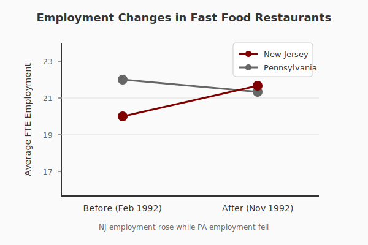{fig-align="center" width="80%"}

---

## The surprising result

Employment in New Jersey *increased* relative to Pennsylvania.

. . .

This challenged the conventional wisdom that minimum wage increases destroy jobs.

. . .

> **The lesson:** Economic theory gives us predictions, but data tells us what actually happens.

---

## Why might the textbook be wrong?

Several explanations have been proposed:

. . .

1. **Monopsony power** — Employers have wage-setting power

. . .

2. **Efficiency wages** — Higher wages increase productivity

. . .

3. **Reduced turnover** — Less costly hiring and training

. . .

4. **Price adjustments** — Costs passed to consumers

---

## Discussion: What makes this convincing?

Think about:

- Why is Pennsylvania a good comparison for New Jersey?
- What could still go wrong with this design?
- Would you be convinced?

# Interrupted Time Series {background-color="#800000"}

What happens when everything changes at once?

---

## The simplest quasi-experiment

**Idea:** Compare outcomes before and after a sudden change.

. . .

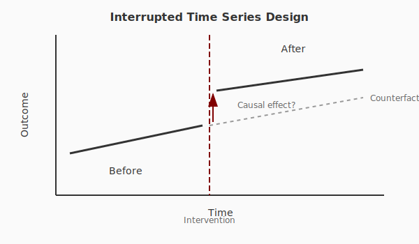{fig-align="center" width="80%"}

---

## Example: Police violence and civic engagement

Ang et al. (2025) studied how people's engagement with police changed after George Floyd's murder in May 2020.

. . .

**The event:** A dramatic, sudden shift in public attention to police violence.

. . .

**The question:** Did this attention reduce engagement with, and favorability of, police?

---

## What the data showed

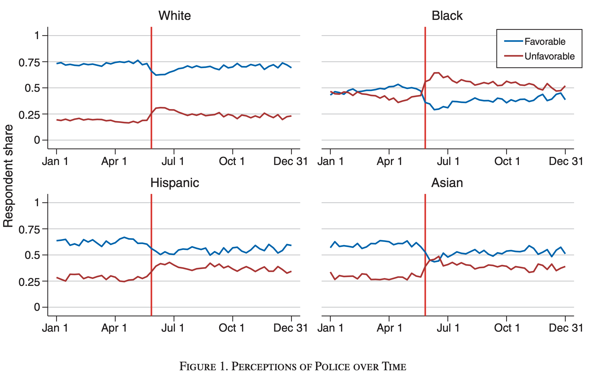{fig-align="center" width="80%"}

---

## What the data showed

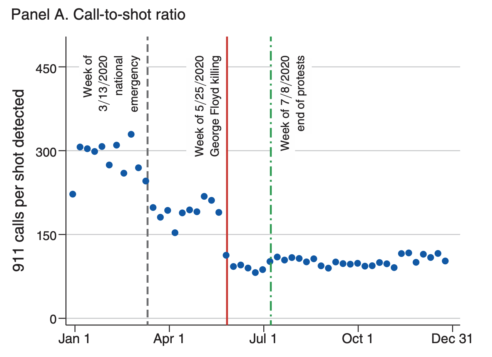{fig-align="center" width="80%"}

---

## Interpreting the results

Police favorability and crime reporting rates fell significantly after the event.

. . .

But is this causal? What else changed in May 2020?

. . .

**Potential confounds:**

- COVID-19 pandemic
- Protests and civil unrest
- Policy changes in many departments
- Economic disruption

---

## The limits of interrupted time series

:::: {.columns}
::: {.column width="50%"}
**Strengths:**

- Simple and intuitive
- Works with just one group
- Easy to visualize
:::
::: {.column width="50%"}
**Weaknesses:**

- Can't separate the event from other changes
- Assumes trend would have continued
- No control group to compare against
:::
::::

. . .

> **Bottom line:** Good for description, risky for causal claims.

# Difference-in-Differences {background-color="#800000"}

Adding a control group to time series

---

## The key insight

What if we could account for time trends using a comparison group?

. . .

**Difference-in-differences (DiD):**

1. Compare treated group before and after (first difference)
2. Compare control group before and after (second difference)
3. Subtract to remove common trends (difference in differences)

---

## The DiD logic

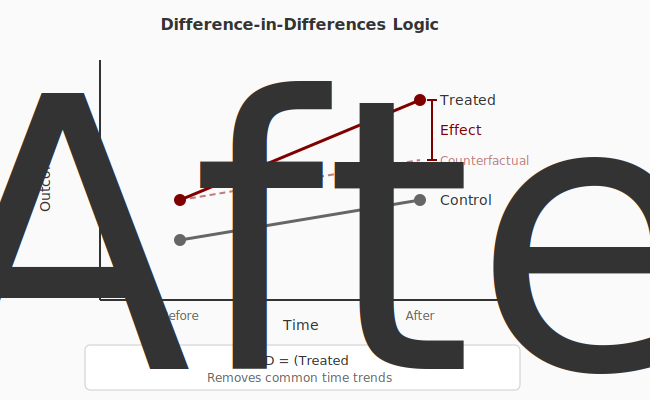{fig-align="center" width="85%"}

---

## The parallel trends assumption

For DiD to work, we need to assume:

. . .

> Without treatment, the treated and control groups would have followed **parallel trends**.

. . .

This is the key identifying assumption.

. . .

We can *never* prove it's true (we don't observe the counterfactual), but we can look for evidence against it.

---

## Testing parallel trends

**Pre-trends test:** Do the groups have similar trends *before* treatment?

. . .

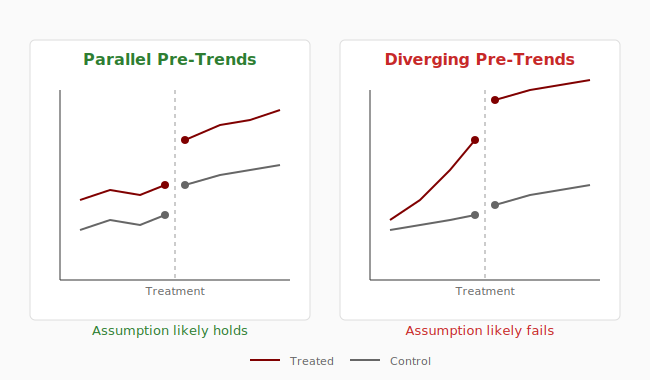{fig-align="center" width="80%"}

---

## Example: Medicaid expansion and mortality

Sommers et al. (2012) studied how Medicaid coverage affects mortality.

. . .

Some states expanded between 2000 and 2002, others did not.

. . .

**Research question:** Did Medicaid expansion reduce deaths?

::: {.notes}
Sommers et al. (2012). "Mortality and Access to Care among Adults after State Medicaid Expansions." The New England Journal of Medicine.
:::

---

## The study design

:::: {.columns}
::: {.column width="50%"}
**Treatment:**

States that expanded Medicaid
:::
::: {.column width="50%"}
**Control:**

Neighboring states that did not expand
:::
::::

. . .

Compare changes in mortality rates before and after expansion.

---

## DiD in the wild

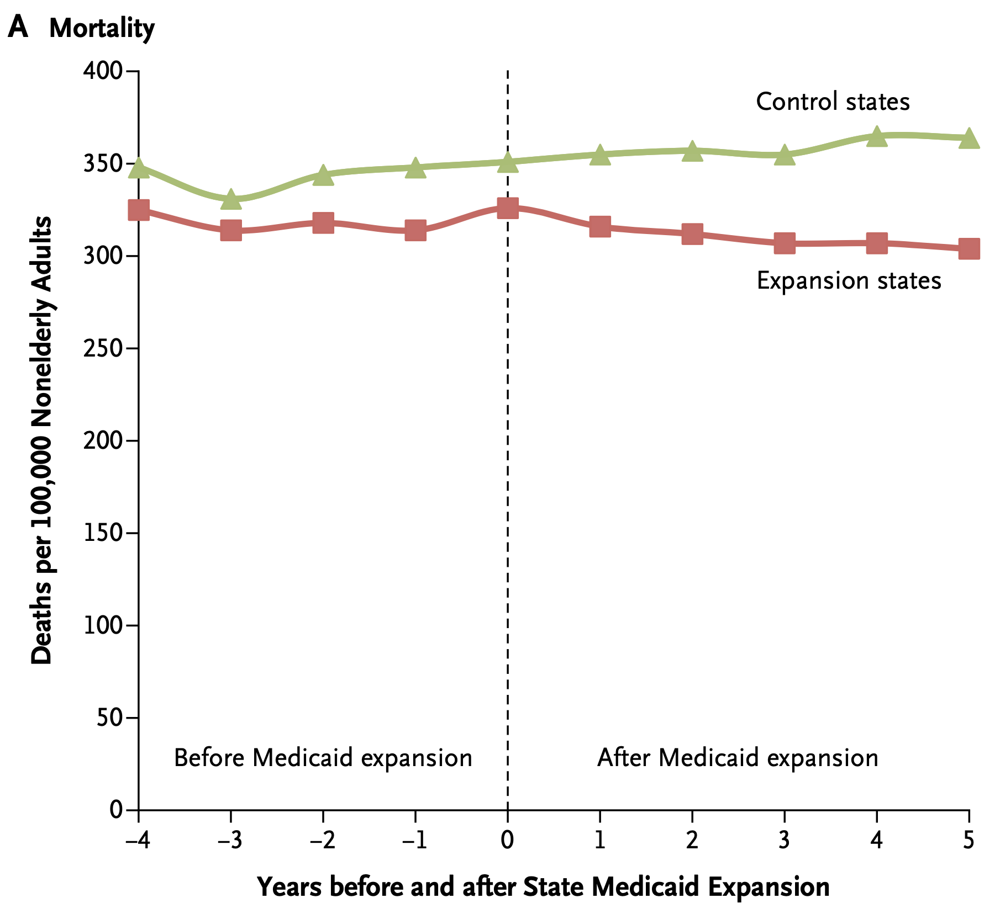{fig-align="center" width="80%"}

---

## Results: Lives saved 

The study found that Medicaid expansion **reduced mortality**.

. . .

Approximately **1 death prevented per 176 additional people covered**.

. . .

Effects were largest for:

- People aged 35-64
- Poorer counties
- Minorities

::: {.notes}
Sommers et al. (2012). "Mortality and Access to Care among Adults after State Medicaid Expansions." The New England Journal of Medicine.
:::

---

## Example: Cancer clusters and anxiety

Davis et al. studied what happens when communities learn they're near a contaminated site.

. . .

**The event:** EPA designates a Superfund site (toxic waste cleanup needed).

. . .

**Treatment:** People living near designated sites

**Control:** People living near sites that will be designated later

---

## What they found

After Superfund designation:

- Increased depression and anxiety diagnoses
- More mental health prescriptions
- Effects concentrated among parents with young children

. . .

> **Key insight:** Even the *information* about environmental risk affects health.

::: {.notes}
Reference: Davis (2021). "The Economic Determinants of Mental Health." Working paper.
:::

---

## Discussion: When does DiD work?

Think about:

- What would make you believe the parallel trends assumption?
- When might treated and control groups trend differently?
- How would you choose a control group?

# Regression Discontinuity {background-color="#800000"}

Exploiting arbitrary cutoffs

---

## The intuition

Many policies have **sharp cutoffs**:

- You're eligible if your score is above X
- You get the scholarship if your income is below Y
- You're assigned to the advanced class if you score above Z

. . .

People just above and just below the cutoff are nearly identical...

. . .

...except one group gets treated and the other doesn't.

---

## The RD design

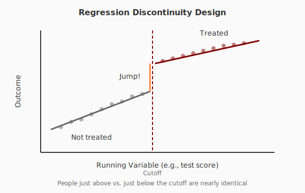{fig-align="center" width="85%"}

---

## Why this works

**Key insight:** At the cutoff, treatment is essentially random.

. . .

Someone who scored 79 vs 81 on a test:

- Very similar abilities
- Very similar backgrounds
- But one gets the program, one doesn't

. . .

> The discontinuity creates a mini-experiment.

---

## Example: Class size and learning

Angrist and Lavy (1999) studied how class size affects student achievement.

. . .

**The setting:** Israel has a rule (Maimonides' Rule) that caps classes at 40 students.

. . .

- 40 students → 1 class of 40
- 41 students → 2 classes of ~20

---

## The class size discontinuity

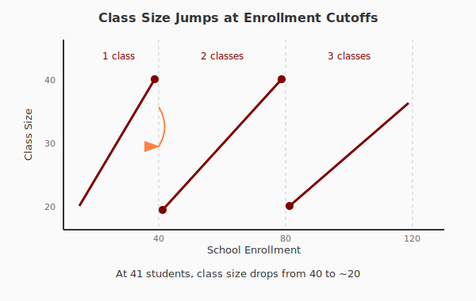{fig-align="center" width="80%"}

---

## Results

At the discontinuity where classes suddenly get smaller:

. . .

- Test scores jump significantly
- Effect equivalent to about 0.2-0.3 standard deviations

. . .

> **Implication:** Smaller classes *do* improve learning.

::: {.notes}
Angrist and Lavy (1999). "Using Maimonides' Rule to Estimate the Effect of Class Size on Scholastic Achievement." Quarterly Journal of Economics.
:::

---

## Example: Close elections

Lee (2008) studied whether winning an election affects future electoral success.

. . .

**The cutoff:** 50% of the vote

- 49.9% → You lose
- 50.1% → You win

. . .

Candidates just above and below 50% had essentially identical support.

---

## What winning gets you

Barely winning an election vs. barely losing:

. . .

- **Incumbency advantage** of about 6-8 percentage points in the next election
- Access to campaign resources
- Name recognition
- Ability to deliver for constituents

::: {.notes}
Lee (2008). "Randomized Experiments from Non-random Selection in U.S. House Elections." Journal of Econometrics.
:::

---

## Example: College access

Mountjoy (2022) studied the effects of attending a four-year vs. two-year college.

. . .

**The design:** Many students are at the margin of admission.

- Just above the cutoff → Admitted to four-year college
- Just below the cutoff → Community college

---

## What a four-year degree gets you

At the admission cutoff:

. . .

- Higher probability of getting a bachelor's degree
- Approximately 10% higher earnings
- But effects vary by student background

::: {.notes}
Mountjoy (2022). "Community Colleges and Upward Mobility." American Economic Review.
:::

---

## What can go wrong with RD?

**Manipulation:** What if people can game the cutoff?

. . .

- Students retaking tests until they pass
- Doctors rounding blood pressure readings
- Officials adjusting income reports

. . .

**Test:** Check for bunching at the cutoff.

---

## Testing for manipulation

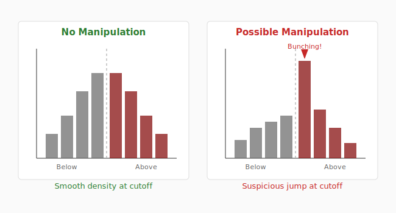{fig-align="center" width="80%"}

---

## Discussion: Finding discontinuities

Think about:

- What policies create sharp cutoffs?
- Where might you look for RD opportunities?
- What makes a cutoff credible?

# Instrumental Variables {background-color="#800000"}

Using external sources of variation

---

## The problem

What if treatment is always correlated with outcomes?

. . .

**Example:** Does education increase earnings?

- People who get more education might be:
  - More motivated
  - More able
  - From wealthier families

. . .

We can't just compare educated vs. less-educated people.

---

## The IV solution

Find something that:

1. **Affects** whether you get treated (education)
2. **Only affects** the outcome (earnings) *through* treatment

. . .

This is called an **instrumental variable** or **instrument**.

---

## The IV logic

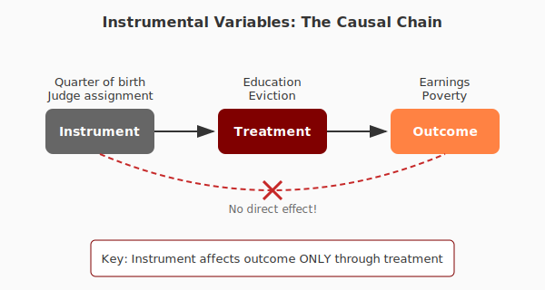{fig-align="center" width="85%"}

---

## Example: Birthday and education

Angrist and Krueger (1991) used **quarter of birth** as an instrument for education.

. . .

**Why quarter of birth matters:**

- School entry cutoffs are based on birthdate
- Compulsory schooling laws require attendance until age 16
- People born earlier in the year can drop out with less education

---

## The clever insight

Someone born in January vs. December:

. . .

- Essentially random (parents don't plan this)
- But affects years of schooling due to school rules
- Quarter of birth shouldn't directly affect earnings

. . .

So any earnings difference must be *through* education!

::: {.notes}
Angrist and Krueger (1991). "Does Compulsory School Attendance Affect Schooling and Earnings?" Quarterly Journal of Economics.
:::

---

## Results

Using quarter of birth as an instrument:

. . .

Each additional year of schooling increases earnings by about **7-10%**.

. . .

This is similar to (but more credibly causal than) simple comparisons.

---

## Example: Eviction and poverty

Collinson et al. studied whether eviction makes people poorer.

. . .

**The problem:** People who get evicted are different:

- Lower income
- Less stable employment
- May have other challenges

. . .

**The instrument:** Random assignment of cases to judges who differ in harshness.

::: {.notes}
Collinson, Humphries, Mader, Reed, Tannenbaum, and van Dijk (2024). "Eviction and Poverty in American Cities." Quarterly Journal of Economics.
:::

---

## Judge leniency as an instrument

Some judges are "tough" (evict more often), some are "lenient."

. . .

- Cases are randomly assigned to judges
- Your judge's leniency predicts whether you're evicted
- But judge assignment shouldn't directly affect your outcomes

. . .

This isolates the causal effect of eviction itself.

---

## What eviction does

Being evicted (due to a harsh judge) leads to:

. . .

- **Homelessness:** Large increase in shelter use
- **Residential instability:** Frequent moves
- **Financial distress:** Emergency room visits, debt collection
- **Neighborhood downgrading:** Move to worse areas

::: {.notes}
Collinson et al. (2024). "Eviction and Poverty in American Cities." Quarterly Journal of Economics.
:::

---

## What can go wrong with IV?

**Problem 1: Weak instruments**

If the instrument barely affects treatment, estimates are noisy and biased.

. . .

**Problem 2: Exclusion restriction violations**

What if the instrument affects outcomes directly?

- Quarter of birth → seasonal differences in health?
- Judge harshness → affects other case characteristics?

---

## The exclusion restriction

> The instrument must affect the outcome **only through** the treatment.

. . .

This assumption can never be tested directly.

. . .

We rely on:

- Economic reasoning
- Checking for obvious violations
- Testing robustness to different instruments

# Putting It All Together {background-color="#800000"}

Choosing your approach

---

## Matching methods to questions

| Method | When to use | Key assumption |
|--------|-------------|----------------|
| ITS | Sudden, universal change | No other changes |
| DiD | Treatment varies across groups | Parallel trends |
| RD | Sharp eligibility cutoff | No manipulation |
| IV | External source of variation | Exclusion restriction |

---

## The hierarchy of evidence

. . .

1. **Randomized experiments** — Gold standard, but often infeasible

. . .

2. **Natural experiments** — Next best, requires careful validation

. . .

3. **Observational comparisons** — Last resort, highly susceptible to bias

---

## What makes a study convincing?

. . .

**Transparency:** Authors show their work, including failures

. . .

**Robustness:** Results hold under different specifications

. . .

**Mechanisms:** Findings align with economic theory

. . .

**Replication:** Other researchers find similar results

---

## The skeptic's checklist

When reading a quasi-experimental study, ask:

. . .

1. What is the identifying assumption?
2. What specification tests do they run?
3. What could violate the assumption?
4. How robust are the results?
5. Does the mechanism make sense?

---

## Discussion: Designing your own study

Imagine you want to know:

> Does remote work increase or decrease productivity?

. . .

How would you design a study using each method?

- Interrupted time series?
- Difference-in-differences?
- Regression discontinuity?
- Instrumental variables?

# Key Takeaways {background-color="#800000"}

---

## What we learned today

. . .

**Quasi-experiments** let us find causal effects without randomization.

. . .

Each method has **identifying assumptions** that must be carefully evaluated.

. . .

**Specification tests** help us assess whether assumptions are plausible.

. . .

Being a good economist means knowing both methods and their **limitations**.

---

## The power of quasi-experiments

These methods have transformed economics:

. . .

- Minimum wage research changed policy debates
- Medicaid studies informed healthcare policy
- Education research shaped school funding decisions
- Criminal justice research influenced sentencing reform

. . .

> **You can change the world** by finding the right natural experiment.

---

## Next time

We'll continue with labor markets and the future of work:

- How technology changes labor demand
- The economics of artificial intelligence
- What skills will matter in the future

---

## Further reading

For those interested in learning more:

- Angrist & Pischke, *Mastering 'Metrics* (accessible introduction)
- Card, "The Elusive Search for Negative Wage Effects" (minimum wage review)
- Lee & Lemieux, "Regression Discontinuity Designs in Economics" (RD methods)
