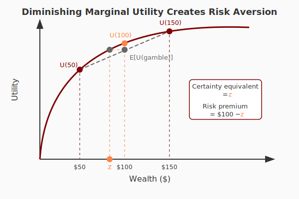
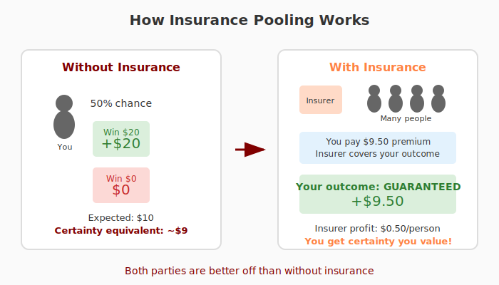
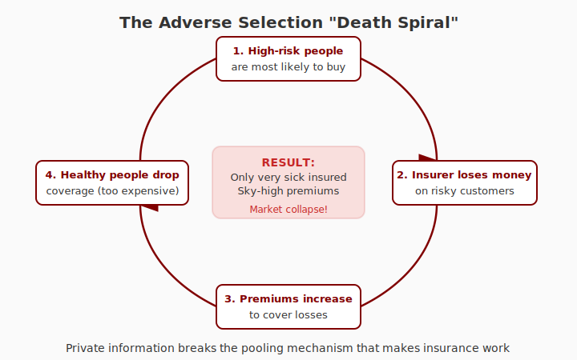

## Life is uncertain

Every time you step out the door, it might rain.

. . .

Every time you get behind the wheel, you might crash.

. . .

Every time you prepare for a test, you might fail---or ace it!

. . .

> These events create **risk** that we face all the time.

## We respond to risk constantly

- Keep an umbrella by the door
- Carry car insurance before driving
- Study extra hard for a difficult exam

. . .

But the stakes go far beyond umbrellas and midterms...

## High-stakes risks

At any moment, someone might:

- Lose their job
- Develop a devastating illness
- Lose their house to a fire
- Live much longer than they've saved for

. . .

> In the worst case, these risks spell **financial catastrophe**.

# Why Risk Matters for the Economy {background-color="#800000"}

## Specialization requires risk-bearing

Modern economies profit from **specialization**.

. . .

But specialization often comes with volatility:

- Farmers' projects fail
- Companies go bust
- Technology makes occupations obsolete

. . .

> If individuals had to bear all risk alone, many would avoid specializing and choose safety over productivity.

## Insurance enables modern economic life

Institutions that shield us from risk through tools like **insurance** are not peripheral.

. . .

They make modern economic life possible.

## Big policy questions about risk

- Should the government provide retirement income through Social Security?

. . .

- Should it compel everyone to buy health insurance?

. . .

- Should unemployment insurance be generous---or limited?

. . .

- Who should bear the risk when banks fail, or pandemics shut down the economy?

# Key Concepts {background-color="#800000"}

## Definitions to know {style="font-size: 0.9em;"}

| Term | Definition |
|------|------------|
| **Risk aversion** | Preferring certainty over gambles with the same expected value |
| **Certainty equivalent** | The guaranteed amount you'd accept instead of a gamble |
| **Adverse selection** | When high-risk individuals are more likely to buy insurance |
| **Moral hazard** | When insurance changes behavior in ways that increase costs |
| **Unraveling** | When adverse selection causes markets to collapse |

# Risk and Choices {background-color="#800000"}

## A simple choice

Suppose I offer you:

:::: {.columns}
::: {.column width="50%"}
**Option A**

$100, guaranteed
:::
::: {.column width="50%"}
**Option B**

50% chance of $300

50% chance of $0
:::
::::

. . .

What would you pick and why?

## Expected value vs. certainty

**Option B** has higher expected value:

$$\mathbb{E}[\text{Option B}] = 0.5 \times \$300 + 0.5 \times \$0 = \$150$$

. . .

But sometimes you make a lot more, and sometimes you make **nothing**.

. . .

> If you really dislike making nothing, you might prefer the sure thing.

## Risk aversion

Our degree of **risk aversion** shapes how much we prefer sure things over gambles.

. . .

Most people are risk averse, meaning they would give up some expected value for certainty.

. . .

> We are **willing to pay for certainty**.

# Let's Play a Game {background-color="#800000"}

## The coin flip game

I'm going to sell you the opportunity to play a game:

. . .

- I flip a coin
- **Heads:** You win $20
- **Tails:** You win nothing

. . .

**Question:** What's the most you'd pay to play?

## How this works

You'll report your maximum willingness to pay.

. . .

**But be warned:**

- I'll draw a random number from 0 to 20
- One person who bid at least that number gets to play
- You pay the number I draw, not your bid

. . .

> Don't underbid---you might miss a great deal!
>
> Don't overbid---you might pay more than you wanted!

## Submit your bid

[Poll Everywhere link]

## Results

[Discussion: What is the mean? What are the tails?]

. . .

Expected value of the game: **$10**

. . .

Average willingness to pay: **~$9** (typically)

. . .

> The gap reveals **risk aversion**.

## Payment time

[Venmo QR code]

# Why Are People Risk Averse? {background-color="#800000"}

## Diminishing marginal utility

The intuition comes from how we experience gains and losses.

. . .

{fig-align="center" width="70%"}

## The key insight

Your first $100 feels more valuable than your hundredth $100.

. . .

This means the **pain** of losing $50 is greater than the **joy** of gaining $50.

. . .

> A fair gamble isn't worth it when losses hurt more than gains feel good.

# Is Insurance a Scam? {background-color="#800000"}

## Back to our coin flip

Average willingness to pay was ~$9, but the game pays $10 on average.

. . .

Is there a market opportunity here?

## An entrepreneurial offer

One of you might offer your classmates:

> "Sell me your opportunity to play for $9.50. You keep that money, but I keep any winnings."

. . .

- How much would you expect to make per game?
- How many people would take the deal?
- If enough people buy, will you lose money?

## Everyone wins!

{fig-align="center" width="80%"}

## Insurance makes everyone better off

Many people think insurance is a scam---companies profit by denying claims.

. . .

But as this example shows, insurance can make **everyone** better off:

- You get certainty (worth paying for)
- The insurer profits from pooling

## Why pooling works

:::: {.columns}
::: {.column width="50%"}
**For individuals:**

- Your outcome is hard to predict
- You're risk averse
- You'd pay for certainty
:::
::: {.column width="50%"}
**For insurers:**

- Aggregate outcomes are predictable
- Risk is spread across many people
- Profits come from the risk premium
:::
::::

## Same logic for health

Flip the game:

- 50% chance you owe the hospital $20
- 50% chance you owe nothing

. . .

You'd pay **more than $10**---say $11---to avoid that risk.

. . .

An insurer happily takes your $11 and covers your bills.

## Insurance is efficient

Both parties are better off than without insurance!

. . .

Private markets provide many insurance products:

- Life insurance
- Car insurance
- Annuities

. . .

> So why doesn't the market handle everything?

# What Can Go Wrong {background-color="#800000"}

## Three problems for insurance markets

1. **Adverse selection** --- Who buys insurance?

2. **Moral hazard** --- How does insurance change behavior?

3. **Correlated risks** --- What if everyone needs payouts at once?

# Adverse Selection {background-color="#800000"}

## The role of private information

Our coin flip game worked because risks were **common knowledge**.

. . .

Everyone had a 50-50 chance, and we all knew it.

. . .

But in reality, individuals often have **private information** about their risk.

## Health insurance example

An insurer knows your age, sex, income, occupation...

. . .

But they might not know:

- You ride a scooter at high speed through alleyways
- Your family has a history of cardiovascular disease

. . .

Often insurers are **legally barred** from using this information.

## Back to the game with a twist

New setup:

- Some of you have a **10%** chance of winning $20
- Others have a **90%** chance of winning $20
- Average is still 50%

. . .

Who would be most likely to sell their gamble for $9?

## The adverse selection spiral

{fig-align="center" width="75%"}

## The death spiral

This process can create a **death spiral**:

1. Only risky people buy insurance
2. Costs rise, so premiums rise
3. Healthier people drop out
4. Only the *very* sick remain
5. Market collapses

. . .

> The private market fails to provide insurance.

## What's the problem?

We let people **choose** whether to participate.

. . .

They make those decisions using **private information** about risk.

. . .

This breaks the pooling mechanism that makes insurance work.

## A potential solution: Mandates

The government can **compel** everyone to participate.

. . .

- Everyone is insured
- No death spiral occurs
- Government can even profit

. . .

But there's no free lunch...

## The mandate tradeoff

Even if mandates help the sick, young healthy people would rather not participate.

. . .

> This helps explain why mandates are so contentious!

# Moral Hazard {background-color="#800000"}

## Insurance changes behavior

Even without adverse selection, being insured can change what you do.

. . .

This is called **moral hazard**.

## Quick examples

**AppleCare on your iPhone:**

Are you more or less likely to use a bulky case?

. . .

**Comprehensive car insurance with no deductible:**

How carefully do you park?

. . .

**Free doctor visits (no copay):**

What happens to healthcare utilization?

## The efficiency problem

Insurance changes behavior **ex-post** (after you're covered).

. . .

This:

- Increases costs for insurers
- Breaks the link between individual behavior and marginal costs

. . .

> We get too many broken iPhones, too many bumper dings, too many doctor visits.

## Product design responses

Insurance products are designed to combat moral hazard:

. . .

**Deductibles:** You pay the first $500 of damage

. . .

**Copays:** You pay $20 per doctor visit

. . .

**Coinsurance:** You pay 20% of costs

. . .

> These keep you somewhat exposed to costs, preserving incentives.

## The design challenge

Getting insurance right means balancing:

- **Ex-ante:** Benefits of risk pooling
- **Ex-post:** Efficient decision-making

. . .

> We're in the world of second-best solutions.

# Correlated Risks {background-color="#800000"}

## Independent vs. correlated risks

Our examples assumed risk was **independent**.

. . .

Whether one person wins $20 is unrelated to whether anyone else does.

. . .

Some risks look like this (health), while others don't (layoffs, floods).

## A thought experiment

Suppose I offer insurance against:

> Global warming raises temperatures by more than 3°C in the next 25 years

. . .

Scientists say this is both possible and would be catastrophic.

. . .

Would any insurer offer this product?

## The problem with correlated risks

**Best case:** Temperatures stay low, insurer keeps all premiums.

. . .

**Worst case:** Temperatures spike, insurer owes **everyone** at once.

. . .

> Total insolvency!

## Where this matters

The same problem crops up in:

- **Flood insurance** (entire regions flood together)
- **Unemployment insurance** (recessions hit everyone)
- **Financial markets** (systemic crises)

. . .

> Private insurers can't credibly promise to pay.

## The government's role

Government can help by:

- **Borrowing from the future** (deficit spending during crises)
- **Pooling across geography** (federal programs)
- **Serving as insurer of last resort**

. . .

But even governments have limits.

# Key Takeaways {background-color="#800000"}

## What we learned today

1. **Risk is everywhere** and shapes economic behavior

. . .

2. **Risk aversion** means people will pay for certainty

. . .

3. **Insurance can make everyone better off** through pooling

. . .

4. **Markets can fail** due to adverse selection, moral hazard, and correlated risks

. . .

5. **Government has a role** when private markets can't function

## Looking ahead

Next time: How markets allocate goods and why they sometimes need help.

::: {.notes}
Key references:
- Akerlof (1970). "The Market for Lemons"
- Rothschild & Stiglitz (1976). "Equilibrium in Competitive Insurance Markets"
- Arrow (1963). "Uncertainty and the Welfare Economics of Medical Care"
:::
