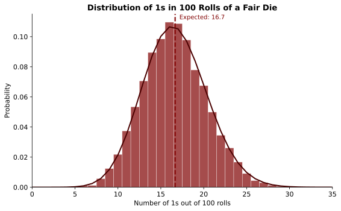
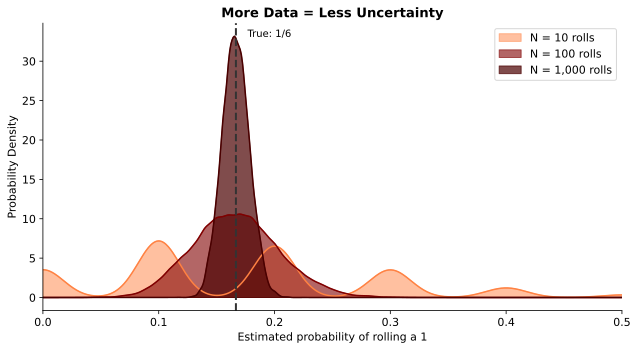
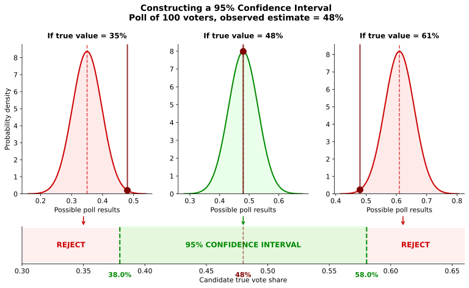
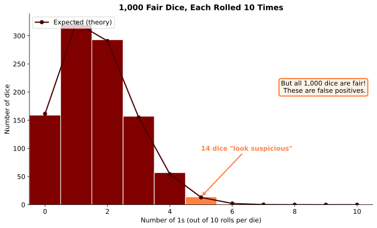

## Switching gears

You've learned one of the most important lessons about data analysis:

> **Correlation does not imply causation.**

. . .

Today we dive into a second crucial issue:

> **How to think about uncertainty.**

---

## A motivating example

Imagine we run an experiment in Chicago Heights.

. . .

- Randomly assign students to earn incentive payments for higher test scores
- Treatment group scores **11% higher** than control

. . .

Great! But we run the experiment again...

. . .

- This time the effect is **15%**

. . .

**What is the true effect?** 11%? 15%? Something else?

---

## The fundamental insight

Even under ideal conditions—a carefully designed randomized experiment—

> **Data do not give us the *truth*. They give us an *estimate*.**

. . .

An estimate is hopefully informative about the truth, but we need to ask: *how* informative?

---

## You've seen this before

**"Margin of error"** on a political poll

. . .

**"Confidence interval"** on an effect estimate

. . .

**"Statistically significant"** effect of a new drug

. . .

These are all ways of quantifying uncertainty.

---

## Key ideas for today

. . .

**Parameters vs. estimates:** The difference between the "true" effect and what data give us

. . .

**Statistical uncertainty:** How informative is any estimate about the underlying truth?

. . .

**Sampling uncertainty:** Uncertainty from only seeing a portion of the full data

. . .

**Confidence intervals:** Measures of which parameters are consistent with your data

. . .

**Bayesian reasoning:** Combining evidence with prior knowledge

# Testing for Loaded Dice {background-color="#800000"}

A hands-on example

---

## A suspicious evening

You're at the craps table. The dice keep coming up snake eyes way more than you'd like.

. . .

Is the casino cheating?

. . .

When nobody's looking, you steal one of the dice to investigate later.

*(You're still many hundreds in the hole.)*

---

## Quick probability check

If the die is fair, what's the chance it comes up 1?

. . .

> **1 in 6** (about 16.7%)

. . .

If we roll twice, what's the chance of getting 1 both times?

. . .

> **1/6 × 1/6 = 1/36** (about 2.8%)

. . .

How many 1s in a row before you get suspicious?

---

## A more formal test

The casino probably isn't *that* clumsy. You decide to run a proper experiment:

. . .

**Roll the die 100 times and count how often it comes up 1.**

. . .

If the die is fair, how many 1s do you expect?

---

## What do you think?

[Poll Everywhere: You roll a fair die 100 times. How many 1s would make you suspicious?]

---

## What does the math say?

{fig-align="center" width="85%"}

Even a fair die won't give you *exactly* 16-17 ones every time.

---

## The key insight

> Even if the die is fair, there's randomness affecting each roll.

. . .

We can't expect exactly 1/6 ones. But we *can* quantify the **range** of outcomes we might see.

. . .

If we get 20 ones out of 100, is that suspicious?

. . .

If we get 30 ones? 40 ones?

. . .

**How can we reduce our uncertainty?**

---

## More data helps

{fig-align="center" width="90%"}

---

## Why does more data help?

As we collect more data, we **average out** the randomness.

. . .

With 10 rolls, getting 3 ones (30%) isn't unusual.

. . .

With 1,000 rolls, getting 300 ones (30%) would be *extremely* suspicious.

. . .

> **More data = Less uncertainty**

# Sampling Uncertainty {background-color="#800000"}

From dice to polls

---

## Same idea, different context

The die example is a type of **sampling uncertainty**.

. . .

- We want to know: How often would this die show 1 if rolled *infinitely* many times?
- We observe: The results of 100 rolls (a **sample**)

. . .

This same logic applies whenever our data is just a **sample** from a larger **population**.

---

## Polling example

You want to measure the share of voters who will support Republicans in the midterms.

. . .

**Ideal approach:** Ask every voter in America.

. . .

**Reality:** That's prohibitively expensive. So you ask a random sample.

---

## How useful is your sample?

**If you ask 1 voter:**

How confident are you that they represent all voters?

. . .

**If you ask 10 voters:**

A bit better, but still pretty uncertain.

. . .

**If you ask 1,000 voters:**

Much more confident that your estimate is close to the truth.

---

## The question

You poll 100 voters and find 48% support Republicans.

. . .

Your goal is to know the *true* support in the full population.

. . .

> How close is 48% to the truth?

. . .

Thankfully, there are tools to answer this question.

# Quantifying Uncertainty {background-color="#800000"}

Building confidence intervals

---

## The easiest way to think about it

Suppose the true Republican vote share is 49%.

. . .

If we sample 100 voters at random, what estimates might we get?

. . .

We could simulate this thousands of times and see the distribution of possible results.

---

## Building a confidence interval

You poll 100 voters and find 48% support Republicans.

. . .

Now ask: **Which true values could have plausibly generated 48%?**

. . .

For each possible true value, we can simulate what estimates we'd get...

---

## Testing the truth: Is it 50%?

If the true share were 50%, simulations show we'd get estimates like 48% pretty often.

. . .

> **50% is consistent** with our data.

---

## Testing the truth: Is it 55%?

If the true share were 55%, getting 48% would be unusual but not crazy.

. . .

> **55% is borderline**—maybe consistent, maybe not.

---

## Testing the truth: Is it 70%?

If the true share were 70%, getting 48% would be *extremely* unlikely.

. . .

> **70% is inconsistent** with our data. We can rule it out.

---

## The confidence interval

A **95% confidence interval** is the set of true values that could have generated our estimate at least 95% of the time.

---

{fig-align="center" width="90%"}

---

## What does the length tell us?

The **length** of the interval reflects your precision.

. . .

- **Short CI** = You can rule out many values (precise estimate)
- **Long CI** = Many values are still plausible (imprecise estimate)

. . .

More data → shorter confidence intervals.

---

## Hypothesis tests

Sometimes we just want a yes/no answer:

> Are the data consistent with a particular value?

. . .

This is called a **hypothesis test**.

. . .

Most commonly: Can we rule out **zero** effect?

. . .

If zero is *outside* our confidence interval, we say the result is **statistically significant**.

---

## An important caveat

**Statistically significant** ≠ **Important**

. . .

- A tiny effect can be "significant" with enough data
- A big effect can be "not significant" with limited data

. . .

Significance just means: *unlikely to be pure noise*

# Cooking the Books {background-color="#800000"}

When statistical tests go wrong

---

## A subtle problem

Even our statistical tests are subject to uncertainty.

. . .

I can never tell you with certainty whether the true vote share is 53% or 51%.

. . .

There's always *some* chance my estimate is just a fluke.

---

## What happens with many tests?

Suppose I give you **1,000 dice**.

. . .

You don't know this, but **all of them are actually fair**.

. . .

You test each die by rolling it 10 times.

. . .

You decide that any die showing 5 or more ones is "suspicious".

---

## The result

{fig-align="center" width="95%"}

---

## The problem

Getting 5+ ones out of 10 rolls happens about 2% of the time for a fair die.

. . .

But with 1,000 dice, you expect about **20 dice** to "look suspicious."

. . .

These aren't loaded—they're **false positives**.

. . .

> **More tests = More flukes**

---

## P-hacking

This is called the **multiple hypothesis testing problem**.

. . .

If I run many experiments and only report the winner, my tests become unreliable.

. . .

Cherry-picking results this way is sometimes called **p-hacking**.

---

## Be skeptical

> Thinking like an economist means being skeptical when someone shows a "significant" result that may just be the survivor of many trials.

. . .

Always ask:

- How many things did they test?
- Are they showing all results or just the "winners"?

# Thinking with Reverend Bayes {background-color="#800000"}

Another way to handle uncertainty

---

## Two approaches to uncertainty

Everything we've discussed is sometimes called **frequentist** reasoning:

. . .

> Quantify uncertainty from seeing limited data—if we repeated the study, we might get different results.

. . .

There's another approach: **Bayesian reasoning**.

---

## Thomas Bayes (1701-1761)

{fig-align="center" height="300"}

Bayesian reasoning combines evidence with your prior knowledge.

::: {.notes}
Portrait from Wikipedia Commons. Bayes was an English statistician and Presbyterian minister.
:::

---

## Let's try it

Thanks to the registrar, I know the average age of everyone in this room.

. . .

**What's your guess?**

::: {.notes}
Poll Everywhere: What do you think the average age in this room is? (in years)
:::

---

## Now let's collect some data

::: {.notes}
Pick 3-4 students at random, have them announce their ages. Compute the sample average live.
:::

. . .

**Do you want to change your guess?**

::: {.notes}
Poll Everywhere: Updated guess for average age?
:::

---

## What just happened?

You started with **prior beliefs** about the average age.

. . .

You saw **evidence** (the sample of ages).

. . .

You updated to form **posterior beliefs**.

. . .

> This is Bayesian reasoning.

---

## The key questions

1. How much did your guess change?
2. What determines how much weight you put on the evidence vs. your prior?

. . .

**Factors that matter:**

- How confident you were initially
- How much evidence you saw
- How surprising the evidence was

---

## Uncertainty still matters

Whether you think like a frequentist or a Bayesian:

> Being able to think about the precision of your estimates is essential.

. . .

Uncertainty determines how much weight to put on evidence vs. prior beliefs.

# Wrapping Up {background-color="#800000"}

---

## What we learned today

**Data give us estimates, not truth.**

. . .

**Uncertainty is unavoidable**—even in perfect experiments.

. . .

**More data reduces uncertainty** by averaging out randomness.

. . .

**Confidence intervals** tell us which parameter values are consistent with our data.

. . .

**Multiple testing** creates false positives—be skeptical of cherry-picked results.

---

## The bottom line

> **Thinking like an economist means understanding that results are subject to statistical uncertainty—and knowing how to quantify it.**

. . .

Whether you're reading a poll, evaluating a drug trial, or running your own experiment, always ask:

> **How confident should I be?**

---

## Questions?

